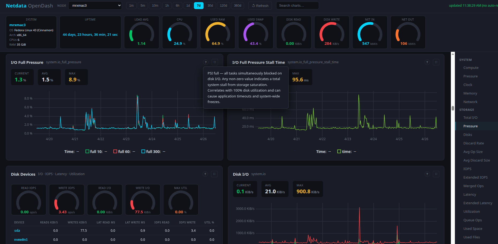

# Netdata Open Dashboard (netdata-odash)

Netdata Open Dashboard is an open source dashboard for Netdata collector

It imposes no node limits and works by querying netdata API endpoints to gather host metrics

The dashboard shows all relevant system metrics and has help dialogue on each chart to explain what the metrics mean and how they correlate to overall system health

This dashboard has been tested on Fedora 43 linux and Rocky 9 linux only

## Installation

For odash to work, you will need a host with netdata installed and has its stream disabled (acts as a collector)

odash will connect to this host via API and query metrics

## Usage

start odash using the systemd script provided

Odash will query Netdata API backend and return a dashboard with metrics.

By default, it will run on localhost port 8080, and query localhost:19999

to change default ports, you can use .env file or export these ENV variables

    NETDATA_PORT=19999

    ODASH_PORT=8080

or pass the ports directly when running the binary

    ./netdata-odash --netdata-port 19999 --odash-port 8080

if ports are passed directly via cli arguments, they will override the environment variables

to see the netdata-odash version, run 

    ./netdata-odash --help

## Build from source

odash requires Crystal language and PCRE devel package

    dnf install pcre-devel

    crystal build src/netdata-odash.cr -o bin/netdata-odash
    
## Roadmap

- add dynamic assistant section - for last 5 min timeframe - check all chart metrics and show warning signs, ie load avg 1min is high, disk IO is high, show warning in this section that load avg + disk io are high and suggest cause for this

## Development

You can contribute to this project by forking this repo and submitting a PR

## Contributing

1. Fork it (<https://github.com/perfecto25/netdata-odash/fork>)
2. Create your feature branch (`git checkout -b my-new-feature`)
3. Commit your changes (`git commit -am 'Add some feature'`)
4. Push to the branch (`git push origin my-new-feature`)
5. Create a new Pull Request

## Contributors

- [mreider](https://github.com/perfecto25) - creator and maintainer
