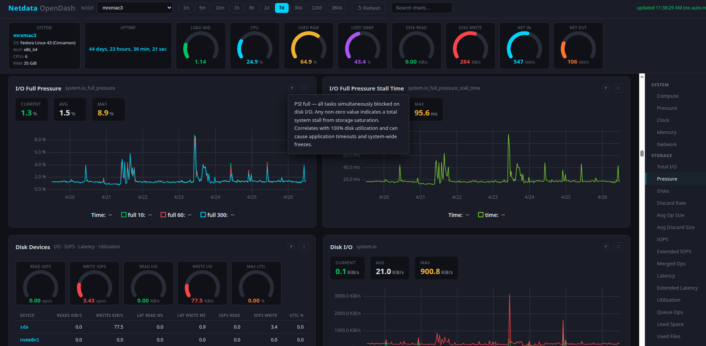
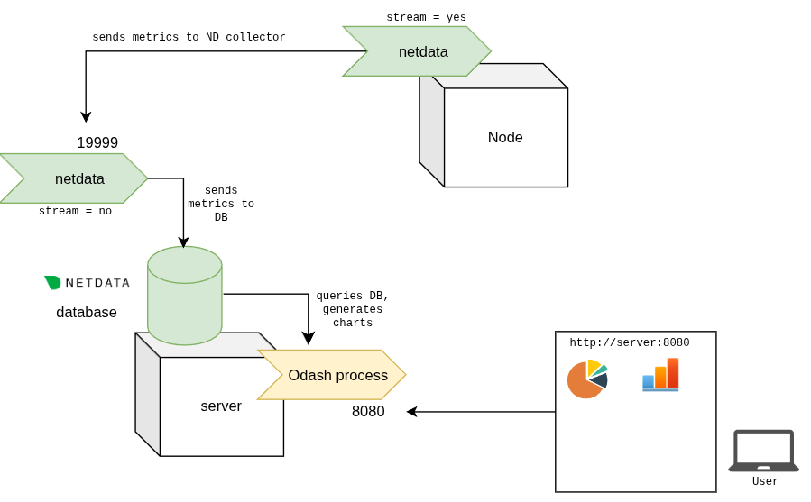

# Netdata Open Dashboard (netdata-odash)

Netdata Open Dashboard is an open source dashboard for Netdata collector

It imposes no node limits and works by querying netdata API endpoints to gather host metrics

The dashboard shows all relevant system metrics and has help dialogue on each chart to explain what the metrics mean and how they correlate to overall system health





This dashboard has been tested on Fedora 43 linux and Rocky 9 linux only


## Installation

For Odash to work, you will need a host with netdata installed and has its stream disabled (acts as a collector)

Odash will connect to this host via API and query metrics, it rides on top of local Netdata agent

**High Level overview**



### Odash Host
On the server thats hosting Netdata-Odash

1. install Netdata package and run netdata service (default port 19999)
1. on same host, edit the /etc/netdata/stream.conf and disable it
```
[stream]
  enabled = no
```
3. install netdata-odash bin (see Releases), run the netdata-odash systemd service (see below)


### Nodes that are sending the metrics
On the server thats sending the Netdata metrics

edit /etc/netdata/stream.conf

```
[stream]
    enabled = yes
    destination = <IP or hostname of Netdata-Odash server>:19999
    api key = 4c2xxxxxxxxxxxxxxxxx
    timeout seconds = 60
    buffer size bytes = 10485760
    reconnect delay seconds = 5
    initial clock resync iterations = 60

[MACHINE_GUID]
    type = machine
    enabled = yes
    allow from = *
    postpone alarms on connect seconds = 60

[registry]
    enabled = no
    registry to announce = http://<IP or hostname of Netdata-Odash server>:19999

```

open up web browser to `http://<IP or hostname of Netdata-Odash server>:8080`


## Usage

start odash using the systemd script provided

Odash will query Netdata API backend and return a dashboard with metrics.

By default, it will run on localhost port 8080, and query localhost:19999


to change default ports, you can use .env file or export these ENV variables

    NETDATA_PORT=19999

    ODASH_PORT=8080

or pass the ports directly when running the binary

    ./netdata-odash --netdata-port 19999 --odash-port 8080

if ports are passed directly via cli arguments, they will override the environment variables

to see the netdata-odash version, run 

    ./netdata-odash --help

By default, all nodes that check into your Odash instance will not show up in the Node drop down

You must approve each node before they show up, by going to Admin button (next to Search field) > Approve > node

You can also delete nodes from Drop down via the same admin interface


## Build from source

odash requires Crystal language and PCRE devel package

    dnf install pcre-devel

    crystal build src/netdata-odash.cr -o bin/netdata-odash
    
## Release

    # cut the release
    git tag v0.1.2
    git push origin v0.1.2


## Roadmap

- add dynamic assistant section - for last 5 min timeframe - check all chart metrics and show warning signs, ie load avg 1min is high, disk IO is high, show warning in this section that load avg + disk io are high and suggest cause for this


## Development

You can contribute to this project by forking this repo and submitting a PR


## Contributing

1. Fork it (<https://github.com/perfecto25/netdata-odash/fork>)
2. Create your feature branch (`git checkout -b my-new-feature`)
3. Commit your changes (`git commit -am 'Add some feature'`)
4. Push to the branch (`git push origin my-new-feature`)
5. Create a new Pull Request

## Contributors

- [mreider](https://github.com/perfecto25) - creator and maintainer

#### Release Notes

### 0.1.2

  - CPU usage and CPU interrupt charts are now full width
  - added escape key shortcut to minimize fully expanded charts
  - added Admin page to approve/reject nodes, able to delete node from drop down
  - click on a section now scrolls down to that section and highlights the chart - instead of zooming into the chart (full screen size)
  - added LM Sensors charts to report sensor data 
  - added GPU charts if GPU is present 
  - added workflows to publish bins
